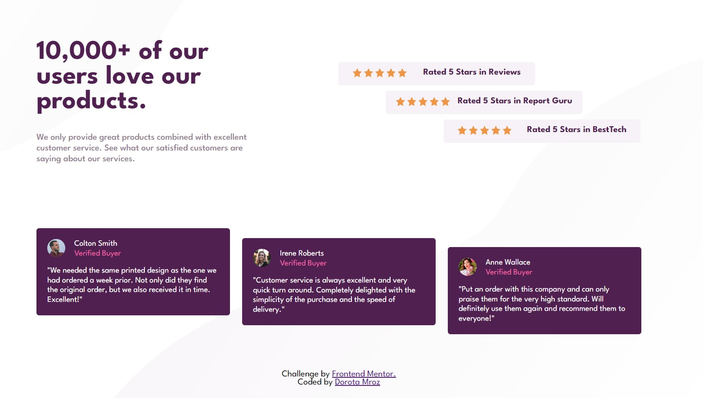
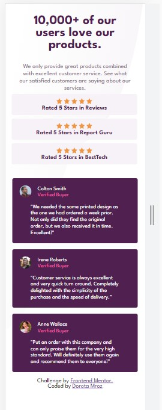

# Frontend Mentor - Social proof section solution

This is a solution to the [Social proof section on Frontend Mentor](https://www.frontendmentor.io/challenges/social-proof-section-6e0qTv_bA). Frontend Mentor challenges help you improve your coding skills by building realistic projects.

## Table of contents

- [Overview](#overview)
  - [The challenge](#the-challenge)
  - [Screenshot](#screenshot)
  - [Links](#links)
- [My process](#my-process)
  - [Built with](#built-with)
  - [What I learned](#what-i-learned)
  - [Continued development](#continued-development)
  - [Useful resources](#useful-resources)
- [Author](#author)

## Overview

### The challenge

Users should be able to:

- View the optimal layout depending on their device's screen size

### Screenshot




### Links

- Solution URL: (https://github.com/DorotaMroz/Social-proof-section-solution)
- Live Site URL: ()

## My process

### Built with

- Semantic HTML5 markup
- CSS custom properties
- Flexbox
- Mobile-first workflow

### What I learned

```css
.row {
  display: flex;
  width: 70%;
  justify-content: space-around;
  align-items: center;
  margin: auto;
}

h1 {
  /**font-size: clamp(2rem, calc(1rem + 5vw), 3rem);
    what this does is states the browser look try and 
    give us a proper relative unit based on that calculation instead(fluid font-size)**/

  font-size: var(--font-size-43px);
  color: var(--very-dark-magenta);
  font-weight: 700;
  padding: 0 3rem 2rem 0;
}
```

### Continued development

I'm still not completely comfortable with positioning, flexbox and grid techniques.

### Useful resources

- (https://www.youtube.com/watch?v=7X8R_KVB3uc&t=5851s)
  This helped me with fluid font-size.

## Author

- Website - (https://doradada.github.io/cv/)
- Frontend Mentor - [@DorotaMroz](https://www.frontendmentor.io/profile/DorotaMroz)
